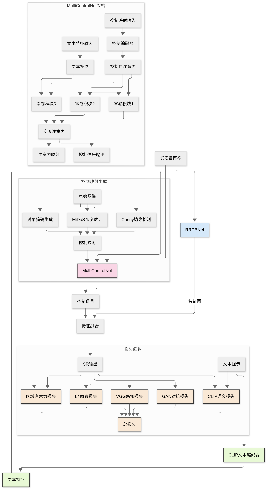

# TGC-ESRGAN: Text-Guided ControlNet Enhanced Super-Resolution

TGC-ESRGAN是一个基于文本引导的超分辨率模型框架，基于[BasicSR框架](https://github.com/XPixelGroup/BasicSR)进行训练，融合了Real-ESRGAN的训练方式，将[ControlNet](https://github.com/lllyasviel/ControlNet)的能力迁移到SRGAN的训练中



## 主要特性

- **文本语义引导**: 利用文本信息指导超分辨率过程，注重描述中提及的区域
- **ControlNet思想**: 利用边缘图、深度图、掩码图三通道控制SR生成

## 实验环境

- Python 3.10
- PyTorch 2.1.0
- CUDA 11.8
- 2080TI 11G * 2

## 安装

### 通过pip安装

```bash
# 克隆仓库
git clone https://github.com/CRui5in/TGC-ESRGAN.git
cd TGC-ESRGAN

# 创建虚拟环境(可选但推荐)
conda create -n tgcesr python=3.10
conda activate tgcesr

# 安装依赖
pip install -r requirements.txt
```

## 许可证

本项目采用MIT许可证

## 致谢

TGSR基于以下开源项目:

- [Real-ESRGAN](https://github.com/xinntao/Real-ESRGAN)
- [BasicSR](https://github.com/XPixelGroup/BasicSR)
- [CLIP](https://github.com/openai/CLIP)
- [ControlNet](https://github.com/lllyasviel/ControlNet)

## 联系方式

- GitHub: [CRui5in](https://github.com/CRui5in) 
