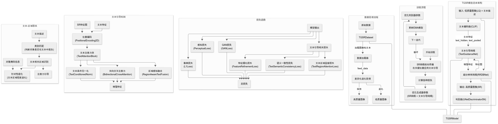

# TGSR: Text-Guided Super-Resolution

TGSR是一个基于文本引导的超分辨率模型框架，将文本描述信息融入超分辨率过程，生成更符合文本语义的高分辨率图像。TGSR基于Real-ESRGAN架构，结合CLIP文本编码器，添加了文本条件注意力模块。



## 主要特性

- **文本语义引导**: 利用文本信息指导超分辨率过程，注重描述中提及的区域
- **多层级特征增强**: 在浅层、中层和深层特征上应用文本引导，实现全面的语义对齐
- **区域感知注意力**: 智能识别图像中与文本相关的区域，有针对性地增强细节
- **三重语义一致性损失**: 
  - 语义一致性损失(l_t_semantic)
  - 注意力区域监督损失(l_t_attn)
  - 特征细化损失(l_t_refine)
- **灵活的训练框架**: 基于BasicSR开发，支持多GPU训练和断点续训

## 实验环境

- Python 3.10
- PyTorch 2.1.0
- CUDA 11.8
- 2080TI 11G * 2

## 安装

### 通过pip安装

```bash
# 克隆仓库
git clone https://github.com/CRui5in/TGSR.git
cd TGSR

# 创建虚拟环境(可选但推荐)
conda create -n tgsr python=3.10
conda activate tgsr

# 安装依赖
pip install -r requirements.txt
```

TGSR需要配对的低/高分辨率图像和对应的文本描述。支持两种格式的数据集:

### 1. COCO格式数据集

```json
[
  {
    "hr_path": "train/hr/image1.jpg",
    "caption": "一只橙色的猫坐在树上",
    "objects": [
      {
        "category": "cat",
        "bbox": [120, 30, 80, 120],
        "mask_encoded": { ... }
      }
    ]
  }
]
```

### 2. 简单文本-图像对

```
image1.jpg    一只橙色的猫坐在树上
image2.jpg    绿色草地上的红色花朵
```

## 预训练模型

TGSR需要预训练的CLIP模型和ESRGAN模型:

```bash
# 下载预训练的模型
mkdir -p pretrained_models
wget -O pretrained_models/clip-vit-base-patch32.pth https://openaipublic.azureedge.net/clip/models/40d365715913c9da98579312b702a82c18be219cc2a73407c4526f58eba950af/ViT-B-32.pt
wget -O pretrained_models/RealESRNet_x4plus.pth https://github.com/xinntao/Real-ESRGAN/releases/download/v0.1.0/RealESRNet_x4plus.pth
```

## 训练

### 单GPU训练

```bash
./tgsr/start_train.sh
```

### 多GPU训练

```bash
# 使用4个GPU训练
./tgsr/start_train.sh
```

### 恢复训练

```bash
python tgsr/train.py -opt options/train_tgsr_x4plus.yml --auto_resume
```

## 推理

### 单张图像处理

```bash
python tgsr/inference.py --input samples/cat.jpg --text "一只橙色的猫坐在树上" --model_path experiments/pretrained_models/TGSR_x4plus.pth --output results/
```

### 批量处理

```bash
python tgsr/inference.py --input samples/ --text_file samples/captions.txt --model_path experiments/pretrained_models/TGSR_x4plus.pth --output results/
```


## 引用

如果您在研究中使用了TGSR，请引用我们的工作:

```

```

## 许可证

本项目采用MIT许可证

## 致谢

TGSR基于以下开源项目:

- [Real-ESRGAN](https://github.com/xinntao/Real-ESRGAN)
- [BasicSR](https://github.com/XPixelGroup/BasicSR)
- [CLIP](https://github.com/openai/CLIP)

## 联系方式

- GitHub: [CRui5in](https://github.com/CRui5in) 
